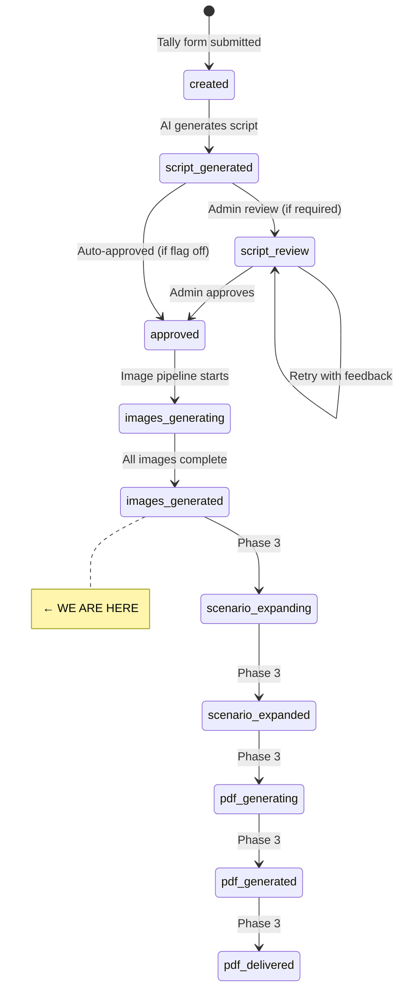

# 📚 EverMagic — Project Documentation

> **Last updated:** March 13, 2026
> **Current Phase:** Phase 3 — PDF Storybook Engine (Step 3.1 foundation built)
> **Completed:** Phases 1 & 2 (Intake + Script Automation + Image Generation) + Step 3.1 Scenario Expansion foundation

---

## 📖 Table of Contents

1. [What is EverMagic?](#-what-is-evermagic)
2. [Product Overview](#-product-overview)
3. [Tech Stack](#-tech-stack)
4. [Architecture Overview](#-architecture-overview)
5. [n8n Workflows — Detailed Breakdown](#-n8n-workflows--detailed-breakdown)
6. [Database Schema](#-database-schema)
7. [Order Data Structure](#-order-data-structure)
8. [State Machine](#-state-machine)
9. [Configuration System (Env Vars)](#-configuration-system-env-vars)
10. [AI Prompts & Themes](#-ai-prompts--themes)
11. [Email System](#-email-system)
12. [Repository Structure](#-repository-structure)
13. [Completed Work](#-completed-work)
14. [Planned Work & Roadmap](#-planned-work--roadmap)
15. [Cost Structure](#-cost-structure)
16. [How to Get Started (For New Contributors)](#-how-to-get-started-for-new-contributors)

---

## ✨ What is EverMagic?

EverMagic is an **AI-first content production engine** that creates personalized cinematic story experiences for kids. A parent fills out a form with their child's details (name, age, appearance, hobbies, photos), and the system automatically generates:

- 🎬 A personalized video (2–3 minutes)
- 📖 An illustrated PDF storybook
- 🖨 Printable bonuses (certificate + coloring pages)
- 📩 Everything delivered by email

**Long-term goal:** A fully automated AI content factory capable of scaling to **$5k–$20k/month** revenue.

**Brand positioning:** EverMagic is not "a children's story" or "a PDF." It's a **personalized digital magic moment** created by a parent — a digital gifting experience.

---

## 🛍 Product Overview

### Packages

| Package | Contents | Target Price |
|---------|----------|-------------|
| **Basic** | PDF storybook + certificate + coloring pages | $9–15 CAD |
| **Full Bundle** | Video + PDF storybook + printables | $35–49 CAD |
| **Party Pack** | TBD — future expansion | TBD |

### Channels

| Channel | Product | Purpose |
|---------|---------|---------|
| **Etsy / Amazon** | PDF bundle | Market validation, reviews, proof |
| **KidsTukan / Direct** | Premium bundle (video + PDF) | High-margin premium experience |

### Current MVP

- **Theme:** Space Hero Mission (only theme currently active)
- **Language:** English only (Ukrainian planned)
- **Focus:** Backend automation pipeline (not branding/marketing)

---

## ⚙️ Tech Stack

| Layer | Tool | Status |
|-------|------|--------|
| **Frontend / Intake** | Tally (form + file upload) | ✅ Active |
| **Payments** | Stripe | 📋 Planned (Phase 5) |
| **Backend Orchestration** | n8n Cloud | ✅ Active |
| **Database** | Supabase (Postgres) | ✅ Active |
| **File Storage** | Supabase Storage | ✅ Active |
| **AI — Script Generation** | OpenAI GPT-4o / GPT-5-nano | ✅ Active |
| **AI — Image Generation** | OpenAI gpt-image-1 | ✅ Active |
| **AI — Scenario Expansion** | OpenAI GPT-4o | 📋 Phase 3 |
| **PDF Generation** | PDFShift API | 📋 Phase 3 |
| **Audio / Audiobook** | ElevenLabs | 📋 Phase 3–4 |
| **Video Rendering** | TBD (Remotion / FFmpeg / Creatomate) | 📋 Phase 4 |
| **Email Delivery** | SMTP via n8n | ✅ Active |
| **Config / Env Vars** | Supabase `envs` table | ✅ Active |
| **Prompt Storage** | GitHub (raw file fetch) | ✅ Active |

---

## 🏗 Architecture Overview

```
┌─────────────┐     ┌─────────────────────────────────────────────────────────────────────┐
│   CUSTOMER   │     │                         n8n CLOUD                                   │
│              │     │                                                                     │
│  Tally Form  │────▶│  Workflow 1: EverMagic v1.0.1 (Intake + Script)                     │
│              │     │    Webhook → Parse → Save → Prompt → OpenAI → Save Script → Email   │
└─────────────┘     │                                                                     │
                    │  Workflow 2: EverMagic Review (Admin Review Page)                    │
┌─────────────┐     │    GET webhook → Router → Approve / Retry Form / Edit Form           │
│    ADMIN     │────▶│                                                                     │
│  (via email) │     │  Workflow 3: EverMagic Review Submit (Form Submissions)              │
│              │     │    POST webhook → Save → Re-generate (retry) / Save edit            │
└─────────────┘     │                                                                     │
                    │  Workflow 4: EverMagic Image Generation                              │
                    │    Manual trigger → Build prompts → OpenAI Image API → Storage       │
                    └─────────────────────┬───────────────────────────────────────────────┘
                                          │
                    ┌─────────────────────▼───────────────────────────────────────────────┐
                    │                      SUPABASE                                       │
                    │  Tables: orders, order_payloads, scripts, images, envs              │
                    │  Storage: images/{order_id}/{image_type}.webp                       │
                    └─────────────────────────────────────────────────────────────────────┘
```

### End-to-End Pipeline Flow

```
Customer fills Tally form
    ↓
Tally Webhook → n8n (EverMagic v1.0.1)
    ↓
Parse & validate order → Save to Supabase (orders + order_payloads)
    ↓
Fetch system prompt from GitHub → Build personalized prompt → Send to OpenAI GPT
    ↓
Parse AI script → Save to Supabase (scripts table)
    ↓
Update order status → Build emails → Send (customer confirmation + admin review)
    ↓
Admin clicks Approve / Retry / Edit in email
    ↓
n8n (Review workflow) → Approve: update status to "approved"
                       → Retry: show feedback form → regenerate with AI
                       → Edit: show inline editor → save manual edits
    ↓
Image Generation (manual trigger or auto if approval not required)
    ↓
Build image prompts → Fetch face photos → Call OpenAI Image API (per scene)
    ↓
Upload to Supabase Storage → Update images table → Update order status
```

---

## 🔧 n8n Workflows — Detailed Breakdown

### Workflow 1: `EverMagic v1.0.1` — Order Intake & Script Generation

**Trigger:** POST webhook at `/evermagic/intake` (secured via Header Auth `X-EverMagic-Token`)

**Node chain (13 nodes):**

```
Load Envs → Envs (parse) → Receive Order (webhook)
    → Validate and Transform Order
    → Save Order to Database (orders table)
    → Save Order Payload (order_payloads table)
    → Fetch Script Prompt (from GitHub raw URL)
    → Build Script Prompt (combine system prompt + order data)
    → Generate Script with AI (OpenAI GPT-5-nano)
    → Parse Script (extract JSON from AI response)
    → Save Generated Script (scripts table)
    → Update Order Status
    → Build Emails → Send Confirmation Email
```

**Key behaviors:**
- Loads `envs` table at workflow start to read `mode` and `script_approval_required` flags
- Validates all required fields (email, child_name, age, package, hero_trait, consent, photo_main)
- Generates order ID in format `EM-YYYYMMDD-XXXX`
- If `script_approval_required` is `false`, script is auto-approved (status: `approved`) and images can start immediately
- If `true`, script saved as `draft` and admin gets review buttons in email
- Sends 2 emails: customer confirmation + admin review

---

### Workflow 2: `EverMagic Review` — Admin Review Interface

**Trigger:** GET webhook at `/evermagic/review` (called from email links)

**Query parameters:** `order_id`, `version`, `action` (approve / retry / edit)

**Node chain (13 nodes):**

```
Load Envs → Envs → Webhook
    → Review Router (parse query params, validate)
    → Fetch Script Version (from Supabase)
    → If (check if already approved — guard against double-approval)
    → Switch Action:
        → "approve": Build Approve Response → Approve Script (update status) → Update Order Status → Respond HTML
        → "retry": Build Retry Form (HTML form with feedback textarea) → Respond HTML
        → "edit": Build Edit Form (full inline script editor) → Respond HTML
        → fallback: Respond Error
```

**Key behaviors:**
- Renders full HTML pages as webhook responses (approve confirmation, retry form, edit form)
- **Double-approval guard:** If script is already approved, returns "Already Approved" page
- Edit form includes inline fields for title, tagline, all 5 scenes (narration, visual description, emotion)
- Retry form provides a feedback textarea for AI regeneration

---

### Workflow 3: `EverMagic Review Submit` — Process Admin Actions

**Trigger:** POST webhook at `/evermagic/review-submit` (form submissions from Review workflow)

**Node chain (14 nodes):**

```
Webhook → Envs
    → Review Router → Handle Submit (parse body, determine action)
    → Switch Submit Action:
        → "retry":
            Respond Retry Confirmation (immediate)
            → Supersede Old Script → Fetch Current Script → Fetch Order
            → Fetch Prompt (GitHub) → Build Retry Prompt (include feedback)
            → Generate Script with AI → Parse Script → Save Generated Script
            → Build Emails → Send Confirmation Email (new review email to admin)
        → "edit_save":
            → Supersede Old Script (Edit) → Save Edited Script (approved)
            → Update Order Status (Edit) → Respond Edit Saved
        → fallback: Respond Error
```

**Key behaviors:**
- **Retry path:** Supersedes old script version, regenerates with AI including admin feedback, sends new review email
- **Edit path:** Supersedes old version, saves manual edits as new approved version, updates order status
- **Script versioning:** Each edit/retry increments `version`, old versions marked `superseded`

---

### Workflow 4: `EverMagic Image Generation` — AI Image Pipeline

**Trigger:** Manual trigger (run from n8n dashboard)

**Node chain (20+ nodes):**

```
Manual Trigger
    → Fetch Approved Scripts (status = "approved")
    → Fetch Order Payload
    → Fetch Existing Images (idempotency check)
    → Parse + Build Prompts (build all image prompts)
    → Switch (insert / update / none based on existing DB state)
        → "insert": Save Images Prompts (new rows)
        → "update": Update Images Prompts (refresh failed prompts)
        → "none": skip (already in progress)
    → Fetch Face Photo (download child's photo as binary)
    → If Extra Photo Exist → Fetch Extra Photo
    → Build OpenAI Request (construct API calls with base64 face reference)
    → Fetch Existing Images to verify → If All Done check
    → Loop Over Items (batch size 1)
        → Call OpenAI Image API (edits or generations endpoint)
        → Process Response (extract base64 → binary)
        → If Success:
            → Upload to Supabase Storage (HTTP POST with binary)
            → Update DB - Image Completed
        → If Failed:
            → Update DB - Image Error
        → Wait (14s rate limit between API calls)
    → Update script status → Update Order Status
```

**Images generated per order (12 total):**
| Type | Count | Quality | Description |
|------|-------|---------|-------------|
| Cover | 1 | medium | Hero pose with cosmic background |
| Scene images | 5 | medium | One per story scene, with face reference |
| Scene coloring pages | 5 | low | B&W line art per scene |
| General coloring page | 1 | low | Generic hero pose coloring |

**Key behaviors:**
- **Idempotent:** Checks existing images DB; skips `completed`, reuses `pending`, refreshes `failed`
- **Face reference:** Downloads child's photo(s), converts to base64, passes to OpenAI `/images/edits` endpoint
- **Coloring pages:** Use `/images/generations` (text-only, no face reference), lower quality to save cost
- **Rate limiting:** 14-second wait between API calls to respect OpenAI limits
- **Theme-aware:** Image prompts configured per theme (currently only `SPACE_HERO` with Pixar-style 3D rendering)
- **Storage:** Images saved as `.webp` to `Supabase Storage` bucket at path `images/{order_id}/{image_type}.webp`

---

## 🗄 Database Schema

### Supabase Tables

#### `orders`

| Column | Type | Description |
|--------|------|-------------|
| `order_id` | TEXT PK | e.g. `EM-20260311-A1B2` |
| `status` | TEXT | Current state in pipeline |
| `email` | TEXT | Customer email |
| `package` | TEXT | BASIC / FULL / PARTY |
| `language` | TEXT | EN / UA |
| `theme` | TEXT | SPACE_HERO |
| `child_name` | TEXT | Child's first name |
| `child_age` | INT | Child's age |

#### `order_payloads`

| Column | Type | Description |
|--------|------|-------------|
| `order_id` | TEXT FK | Reference to orders |
| `payload_json` | JSONB | Full canonical order object (for debugging & re-processing) |

#### `scripts`

| Column | Type | Description |
|--------|------|-------------|
| `order_id` | TEXT FK | Reference to orders |
| `version` | INT | Script version (increments on retry/edit) |
| `status` | TEXT | draft / approved / superseded / images_generated |
| `title` | TEXT | Story title |
| `tagline` | TEXT | Story tagline |
| `content` | JSONB | Full script JSON with scenes |
| `approved_at` | TIMESTAMPTZ | When approved |

#### `images`

| Column | Type | Description |
|--------|------|-------------|
| `id` | UUID PK | Auto-generated |
| `order_id` | TEXT FK | Reference to orders |
| `image_type` | TEXT | cover / scene_1..5 / coloring / coloring_1..5 |
| `prompt` | TEXT | Exact prompt sent to OpenAI |
| `theme` | TEXT | SPACE_HERO etc. |
| `scene_title` | TEXT | Human-readable scene name |
| `face_photo_url` | TEXT | Child's main reference photo URL |
| `extra_photo_url` | TEXT | Optional extra photo URL |
| `generation_params` | JSONB | API params snapshot |
| `file_path` | TEXT | Path in Supabase Storage |
| `file_url` | TEXT | Public URL of generated image |
| `model` | TEXT | Model used (gpt-image-1) |
| `status` | TEXT | pending / generating / completed / failed |
| `error_message` | TEXT | Error details if failed |

#### `envs`

| Column | Type | Description |
|--------|------|-------------|
| `key` | TEXT PK | Variable name |
| `value` | TEXT | Variable value |

Current keys: `mode` (test/live), `script_approval_required` (true/false)

---

## 📋 Order Data Structure

The canonical order JSON that flows through all workflows:

```json
{
  "order_id": "EM-YYYYMMDD-XXXX",
  "package": "FULL",
  "language": "EN",
  "theme": "SPACE_HERO",
  "delivery": { "email": "parent@example.com" },
  "child": {
    "name": "Emma",
    "age": 7,
    "gender": "girl",
    "glasses": false,
    "hair_color": "brown",
    "skin_tone": "medium",
    "hobby": "dinosaurs",
    "hobby_detail": "Loves T-Rex and has a dinosaur collection",
    "signature_look": "Always wears a red cape",
    "jersey_number": "7",
    "recent_win": "Won the school science fair",
    "hero_trait": "brave"
  },
  "parent_message": "We are so proud of you, Emma!",
  "photos": [
    { "url": "https://...", "type": "photo_main" },
    { "url": "https://...", "type": "photo_extra" }
  ],
  "consent": { "accepted": true },
  "meta": {
    "event_id": "...",
    "response_id": "...",
    "form_id": "...",
    "received_at": "2026-03-11T..."
  }
}
```

**Design principles:**
- Only the canonical order object is passed forward in workflows
- Raw Tally webhook payload stored separately in `order_payloads` for debugging
- Personalization data is normalized from Tally's label-based format to structured fields

---

## 🔄 State Machine

```
PHASE 1 — INTAKE & SCRIPT:
  created → validated → script_generated → script_review ↺ retry → approved

PHASE 2 — IMAGE GENERATION:
  approved → images_generating → images_generated

PHASE 3 — PDF (PLANNED):
  images_generated → scenario_expanding → scenario_expanded → pdf_generating → pdf_generated → pdf_delivered

PHASE 4 — VIDEO (PLANNED):
  approved → audio_generating → audio_generated → video_assembling → video_rendered → delivered
```



---

## 🔧 Configuration System (Env Vars)

Global configuration lives in the Supabase `envs` table (key/value rows), loaded at the top of every n8n workflow.

| Key | Values | Purpose |
|-----|--------|---------|
| `mode` | `test` / `live` | Controls webhook routing (test vs production URLs) |
| `script_approval_required` | `true` / `false` | If `false`, scripts auto-approve → images start immediately |

**Usage in n8n Code nodes:**
```js
const env = $('Envs').first().json.env;
// env.mode → "test" or "live"
// env.script_approval_required → true or false
// env.is_live → boolean shortcut
```

This replaces n8n's built-in global variables (unavailable on the basic plan).

---

## 🎨 AI Prompts & Themes

### Script Generation Prompt

Located at: `prompts/space_hero/system.md` (fetched from GitHub at runtime)

The system prompt instructs GPT to act as "the lead screenwriter at EverMagic Studios" and generate a **5-scene personalized cinematic story script**. Key rules:

- Child is the **undisputed hero** — real name used throughout
- Age-appropriate vocabulary (4-6 / 7-9 / 10+)
- 5-scene structure: The Call → The Launch → The Challenge → The Triumph → The Return
- Emotional arc: wonder → excitement → tension → triumph → love
- Parent's message woven naturally into Scene 5
- Each scene: 45–70 words narration + detailed visual description
- Output: valid JSON (no markdown fences)
- Safety: no violence, no scary villains, no assumed family structure

### Image Generation Theme Config

Theme configs are embedded in the Image Generation workflow's `Parse + Build Prompts` node:

```
SPACE_HERO:
  Style: "3D CGI animated character, oversized expressive cartoon head with large round eyes, cinematic lighting"
  Cover: "Cosmic space background with nebula and stars"
  Per-scene: custom lighting + camera angles
  Coloring: "stars, planets, a small rocket" background elements
  Model: openai/gpt-image-1.5, medium quality, webp output
```

Safety rules applied to image prompts (EVRM-012):
- No adult/parent figures in any `visual_description` (family structure unknown)
- No brand references (Pixar, Boss Baby) in style prefix — commercial/legal risk
- Jersey number removed from outfit description — text rendering unreliable in image models

New themes can be added by extending the `THEMES` object in the code node.

---

## 📧 Email System

### Customer Confirmation Email
- **Subject:** `✨ Your magic is being created, {child_name}!`
- Dark themed HTML email with order details
- Shows estimated delivery time (~15 minutes)
- Sent from: `taras.evermagic@gmail.com`

### Admin Review Email
- **Subject:** `📋 Script Review — {order_id} — {child_name}`
- Light themed HTML email with full script preview
- Shows all 5 scenes with narration + visual descriptions
- If `script_approval_required`:
  - Three action buttons: ✅ Approve / 🔄 Edit & Retry / ✏️ Manual Edit
- If auto-approved:
  - FYI notification with "Auto-Approved ✅" badge

---

## 📂 Repository Structure

```
evermagic/
├── project_data/
│   ├── Context.MD              # Master project context & roadmap
│   ├── form_structure.json     # Tally form field definitions
│   ├── phase2_implementation_plan.md  # Phase 2 planning doc
│   └── test-plan-phase1.md     # Phase 1 test plan
├── n8n_backup/
│   ├── 1. EverMagic v1.0.1.json            # Workflow: Order intake + script generation
│   ├── 1.1 EverMagic Review Submit.json    # Workflow: Process review actions
│   ├── 1.2 EverMagic Review.json           # Workflow: Admin review interface
│   ├── 2. EverMagic Image Generation.json  # Workflow: AI image pipeline
│   └── 3.1 EverMagic Scenario Expansion.json  # Workflow: Phase 3 scenario expansion
├── prompts/
│   └── space_hero/
│       ├── system.md           # GPT system prompt for script generation
│       ├── image_prompts.md    # Image prompt guidelines
│       ├── style.md            # Visual style guide
│       └── theme.json          # Theme configuration
├── database/
│   └── images_table.sql        # SQL schema for images table
├── emails/
│   ├── admin-script-review.html     # Admin review email template
│   └── customer-confirmation.html   # Customer confirmation email template
├── scripts/
│   └── export-n8n-workflows.mjs     # Export all n8n workflows via API → n8n_backup/
├── utils/
│   ├── n8n-tally-parser.js          # Tally webhook → order JSON parser
│   ├── n8n-build-emails.js          # Email HTML builder
│   ├── n8n-build-script-prompt.js   # Script prompt builder
│   ├── n8n-build-image-prompts.js   # Image prompt builder
│   ├── n8n-build-expansion-prompt.js # Phase 3: builds GPT-4o expansion prompt
│   ├── n8n-parse-expansion-response.js # Phase 3: parses + validates expansion output
│   ├── n8n-generate-images.js       # Image generation helper
│   ├── n8n-process-image-response.js # Image response processor
│   ├── n8n-reconcile-images.js      # Idempotency reconciliation
│   ├── n8n-call-flux.js             # Flux API caller (deprecated → OpenAI)
│   └── fill-form.js                 # Test utility: auto-fill Tally form
├── temp_data/                        # Sample payloads & test data
│   ├── form_intake_payload_sample.json
│   ├── script_sample.json
│   ├── image_prompts_sample.json
│   └── ...
├── n8n-workflows/
│   └── workflow-image-prompts.json   # WIP workflow fragment
├── DOCUMENTATION.md            # This file
└── README.md                   # Project overview
```

---

## ✅ Completed Work

### Phase 1 — Intake & Script Automation ✅

| Feature | Status |
|---------|--------|
| Tally form with 20 fields across 7 blocks | ✅ |
| Webhook intake with Header Auth security | ✅ |
| Tally payload parsing & canonicalization | ✅ |
| Order data validation (7 required fields) | ✅ |
| Save to Supabase (orders + order_payloads) | ✅ |
| Fetch system prompt from GitHub | ✅ |
| Build personalized prompt from order data | ✅ |
| Generate 5-scene script via OpenAI GPT | ✅ |
| Parse & save script with versioning | ✅ |
| Customer confirmation email (dark themed) | ✅ |
| Admin review email with action buttons | ✅ |
| Approve flow (update script + order status) | ✅ |
| Retry flow (feedback → AI regeneration → new review email) | ✅ |
| Manual edit flow (inline editor → save & approve) | ✅ |
| Script versioning (draft → approved → superseded) | ✅ |
| Double-approval guard | ✅ |
| Auto-approve mode via env flag | ✅ |

### Phase 2 — Image Generation ✅

| Feature | Status |
|---------|--------|
| Fetch approved scripts + order payloads | ✅ |
| Theme-configured prompt builder (extensible) | ✅ |
| Face photo download & base64 conversion | ✅ |
| OpenAI /images/edits with face reference | ✅ |
| OpenAI /images/generations for coloring pages | ✅ |
| 12 images per order (cover + 5 scenes + 6 coloring) | ✅ |
| Upload images to Supabase Storage | ✅ |
| Idempotency: skip completed, reuse pending, retry failed | ✅ |
| Rate limiting (14s delay between API calls) | ✅ |
| Image status tracking in DB | ✅ |
| Order status update on completion | ✅ |
| Env vars system via Supabase envs table | ✅ |

---

## 🗺 Planned Work & Roadmap

### Phase 3 — PDF Storybook Engine 🔄 (Current)

**Goal:** Generate an illustrated PDF storybook as the first sellable product for Etsy.

**Deliverables (3 separate PDFs):**
1. **Storybook PDF** — cover + 5 illustrated scenes with detailed narrative
2. **Coloring Book PDF** — B&W line art pages assembled together
3. **Certificate PDF** — personalized printable achievement certificate

**Steps:**

| Step | Description | Status |
|------|-------------|--------|
| 3.1 — Scenario Expansion | GPT-4o expands scenes into full child-facing narrative with dialogs | ✅ Built and tested |
| 3.2 — PDF Layout Design | HTML/CSS templates for storybook, coloring book, certificate | ✅ Built — design pass done |
| 3.3 — PDF Assembly | Inject content + images into templates → PDFShift → Storage | ✅ Built — E2E test in progress |
| 3.4 — Delivery Flow | Branded download page per order hosted in Supabase Storage | ✅ Designed — not yet built |
| 3.5 — Intake Token System | Single-use tokens to prevent duplicate/unauthorized form submissions | ✅ Designed — not yet built |
| 3.6 — Audiobook Research | Evaluate ElevenLabs for narration quality, cost, format | 📋 Deferred to Phase 4+ |

**Next to build:** Step 3.4 (delivery flow) — generate branded HTML landing page per order, upload to Supabase Storage, email customer one link, notify admin.

**Strategy:** Validate before automating — manually create 1–2 sample PDFs, list on Etsy, get first sale, then automate.

### Delivery Flow Design (Step 3.4)

**Chosen approach:** Branded per-order download page hosted in Supabase Storage (free, no extra infrastructure).

- n8n generates `pages/{order_id}/index.html` after PDFs are assembled
- Page contains: child name, story title, 3 download buttons, thank-you message, EverMagic branding
- Customer receives one email with one link — no attachments, no size limits
- Admin gets a notification email when order is delivered
- Page lives until manually deleted (no expiry for now)

### Intake Token System Design (Step 3.5)

Prevents duplicate submissions and link sharing after Etsy order.

| Detail | Decision |
|--------|----------|
| Token storage | Supabase `intake_tokens` table |
| Token lifecycle | Pre-generated pool of ~100; pick one per order; mark used on submit |
| Cheat token | One hardcoded static token for internal testing (unlimited use) |
| URL format | `tally.so/r/FORM_ID?source=etsy&orderNo=ORDER_NO&token=TOKEN` |
| Enforcement | n8n checks token on webhook receipt before processing |
| Future | `source` param for channel analytics; Stripe coupon system per channel |

---

### Phase 4 — Video Bundle (Premium Product)

Add voice narration + video for the premium KidsTukan bundle.

| Step | Description |
|------|-------------|
| Voice generation | ElevenLabs API → 5 scene narrations |
| Video assembly | Images + voice + transitions + music → MP4 |
| Combined delivery | Video + PDF + printable |

Tools: ElevenLabs (voice), Remotion / FFmpeg / Creatomate (video — TBD).

---

### Phase 5 — Stripe Integration & Storefront

- Stripe checkout flow
- Direct orders without manual Etsy process
- Automated payment → pipeline trigger

---

### Phase 6 — Scale & Optimize

- Additional themes beyond Space Hero
- Multi-language support (Ukrainian)
- Batch processing
- Quality monitoring dashboard
- Customer reviews integration

---

## 💰 Cost Structure

| Step | Tool | Cost per Order |
|------|------|---------------|
| Script generation | OpenAI GPT-4o | ~$0.03 |
| Images (12) | OpenAI gpt-image-1 | ~$0.28 |
| Scenario expansion | OpenAI GPT-4o | ~$0.04 |
| PDF conversion (3) | PDFShift | Free (250/mo) |
| Audiobook (TBD) | ElevenLabs | ~$0.10–0.20 |
| Voice (Phase 4) | ElevenLabs | ~$0.15 |
| Video (Phase 4) | TBD | ~$0.00–0.50 |
| **PDF bundle total** | | **~$0.35/order** |
| **Full bundle total** | | **~$1.00/order** |

**Revenue targets:**

| Product | Price | Cost | Margin | Volume | Monthly Revenue |
|---------|-------|------|--------|--------|----------------|
| PDF Bundle (Etsy) | $9–15 CAD | ~$0.35 | ~97% | 5/day | $1,500–2,250/mo |
| Full Bundle (Premium) | $35–49 CAD | ~$1.00 | ~97% | 2/day | $2,100–2,940/mo |

---

## 🚀 How to Get Started (For New Contributors)

### Understanding the System

1. **Read this document** end-to-end for the full picture
2. **Read `project_data/Context.MD`** for the master context snapshot
3. **Review the n8n workflows** in `n8n_backup/` — they're the heart of the system
4. **Check `prompts/space_hero/system.md`** to understand how scripts are generated

### Key Concepts to Know

- **n8n** is the workflow engine — all orchestration happens here. Each workflow is a chain of nodes (webhook, code, Supabase, HTTP request, email, etc.)
- **Tally** is the form frontend — sends webhook payloads to n8n
- **Supabase** = Postgres database + file storage
- The **env vars system** (`envs` table) controls test/live mode and auto-approval behavior
- **Script versioning** ensures no data loss during review iterations

### Architecture Principles

1. **Deterministic workflows** — n8n handles orchestration, AI handles content
2. **Canonical structured JSON** — one order format flows through everything
3. **Clear state machine** — every order has a status at every moment
4. **Idempotent steps** — re-running image generation skips completed items
5. **Each step saves its output** — full auditability
6. **Retry-friendly and debuggable** — raw payloads stored, versioned scripts
7. **Validate before automating** — manual proof first, then pipeline

### What's Next

The immediate next step is **Phase 3** — building the PDF storybook engine. This involves:
1. Expanding the AI script into full narrative (scenario expansion)
2. Designing HTML/CSS templates for the storybook
3. Assembling content + images into PDFs via PDFShift API
4. Listing on Etsy to validate market demand
