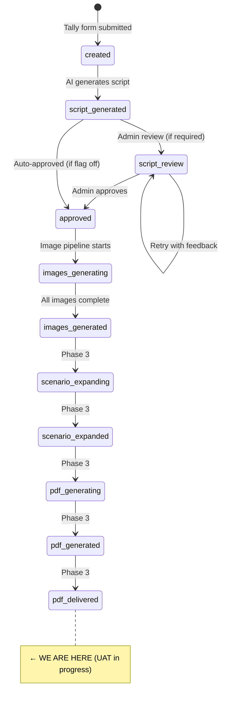

# 📚 EverMagic — Project Documentation

> **Last updated:** March 29, 2026
> **Current Phase:** UAT round in progress — QA loop added to scenario expansion — next: Etsy launch preparation
> **Completed:** Phases 1–3 (Intake + Script + Images + PDF Engine + 5 Themes + Per-Theme Styling + Live Testing + UAT flow + AI QA loop for scenario expansion)
> **Latest tags:** v1.4.0 (4 new themes) · v1.4.1 (per-theme PDF styles) · v1.5.0 (UAT flow) · v2.0.0 (AI QA feedback loop)

---

## 📖 Table of Contents

1. [What is EverMagic?](#-what-is-evermagic)
2. [Product Overview](#-product-overview)
3. [Tech Stack](#-tech-stack)
4. [Architecture Overview](#-architecture-overview)
5. [n8n Workflows — Detailed Breakdown](#-n8n-workflows--detailed-breakdown)
6. [Database Schema](#-database-schema)
7. [Order Data Structure](#-order-data-structure)
8. [State Machine](#-state-machine)
9. [Configuration System (Env Vars)](#-configuration-system-env-vars)
10. [AI Prompts & Themes](#-ai-prompts--themes)
11. [Email System](#-email-system)
12. [Repository Structure](#-repository-structure)
13. [Completed Work](#-completed-work)
14. [Planned Work & Roadmap](#-planned-work--roadmap)
15. [Cost Structure](#-cost-structure)
16. [How to Get Started (For New Contributors)](#-how-to-get-started-for-new-contributors)

---

## ✨ What is EverMagic?

EverMagic is an **AI-first content production engine** that creates personalized cinematic story experiences for kids. A parent fills out a form with their child's details (name, age, appearance, hobbies, photos), and the system automatically generates:

- 🎬 A personalized video (2–3 minutes)
- 📖 An illustrated PDF storybook
- 🖨 Printable bonuses (certificate + coloring pages)
- 📩 Everything delivered by email

**Long-term goal:** A fully automated AI content factory capable of scaling to **$5k–$20k/month** revenue.

**Brand positioning:** EverMagic is not "a children's story" or "a PDF." It's a **personalized digital magic moment** created by a parent — a digital gifting experience.

---

## 🛍 Product Overview

### Packages

| Package | Contents | Target Price |
|---------|----------|-------------|
| **Basic** | PDF storybook + certificate + coloring pages | $9–15 CAD |
| **Full Bundle** | Video + PDF storybook + printables | $35–49 CAD |
| **Party Pack** | TBD — future expansion | TBD |

### Channels

| Channel | Product | Purpose |
|---------|---------|---------|
| **Etsy / Amazon** | PDF bundle | Market validation, reviews, proof |
| **KidsTukan / Direct** | Premium bundle (video + PDF) | High-margin premium experience |

### Current Status

- **Themes (5 active):** Space Hero Mission · Fantasy Hero Quest · Enchanted Princess Adventure · Animal Guardian Hero · Home Helper Hero
- **Language:** English only (Ukrainian planned)
- **Status:** Phases 1–3 complete ✅ — UAT round in progress — next: Etsy launch preparation

---

## ⚙️ Tech Stack

| Layer | Tool | Status |
|-------|------|--------|
| **Frontend / Intake** | Tally (form + file upload) | ✅ Active |
| **Payments** | Stripe | 📋 Planned (Phase 5) |
| **Backend Orchestration** | n8n Cloud | ✅ Active |
| **Database** | Supabase (Postgres) | ✅ Active |
| **File Storage** | Supabase Storage | ✅ Active |
| **AI — Script Generation** | OpenAI GPT-4o / GPT-5-nano | ✅ Active |
| **AI — Image Generation** | OpenAI gpt-image-1 | ✅ Active |
| **AI — Scenario Expansion** | OpenAI GPT-4o | ✅ Active |
| **AI — QA Evaluation** | OpenAI GPT-4o-mini | ✅ Active |
| **PDF Generation** | PDFShift API | ✅ Active |
| **Audio / Audiobook** | ElevenLabs | 📋 Phase 3–4 |
| **Video Rendering** | TBD (Remotion / FFmpeg / Creatomate) | 📋 Phase 4 |
| **Email Delivery** | SMTP via n8n | ✅ Active |
| **Config / Env Vars** | Supabase `envs` table | ✅ Active |
| **Prompt Storage** | GitHub (raw file fetch) | ✅ Active |

---

## 🏗 Architecture Overview

```
┌─────────────┐     ┌─────────────────────────────────────────────────────────────────────┐
│   CUSTOMER   │     │                         n8n CLOUD                                   │
│              │     │                                                                     │
│  Tally Form  │────▶│  Workflow 1: EverMagic v1.0.1 (Intake + Script)                     │
│              │     │    Webhook → Parse → Save → Prompt → OpenAI → Save Script → Email   │
└─────────────┘     │                                                                     │
                    │  Workflow 2: EverMagic Review (Admin Review Page)                    │
┌─────────────┐     │    GET webhook → Router → Approve / Retry Form / Edit Form           │
│    ADMIN     │────▶│                                                                     │
│  (via email) │     │  Workflow 3: EverMagic Review Submit (Form Submissions)              │
│              │     │    POST webhook → Save → Re-generate (retry) / Save edit            │
└─────────────┘     │                                                                     │
                    │  Workflow 4: EverMagic Image Generation                              │
                    │    Manual trigger → Build prompts → OpenAI Image API → Storage       │
                    └─────────────────────┬───────────────────────────────────────────────┘
                                          │
                    ┌─────────────────────▼───────────────────────────────────────────────┐
                    │                      SUPABASE                                       │
                    │  Tables: orders, order_payloads, scripts, images, envs              │
                    │  Storage: images/{order_id}/{image_type}.jpeg                       │
                    └─────────────────────────────────────────────────────────────────────┘
```

### End-to-End Pipeline Flow

```
Customer fills Tally form
    ↓
Tally Webhook → n8n (EverMagic v1.0.1)
    ↓
Parse & validate order → Save to Supabase (orders + order_payloads)
    ↓
Fetch system prompt from GitHub → Build personalized prompt → Send to OpenAI GPT
    ↓
Parse AI script → Save to Supabase (scripts table)
    ↓
Update order status → Build emails → Send (customer confirmation + admin review)
    ↓
Admin clicks Approve / Retry / Edit in email
    ↓
n8n (Review workflow) → Approve: update status to "approved"
                       → Retry: show feedback form → regenerate with AI
                       → Edit: show inline editor → save manual edits
    ↓
Image Generation (manual trigger or auto if approval not required)
    ↓
Build image prompts → Fetch face photos → Call OpenAI Image API (per scene)
    ↓
Upload to Supabase Storage → Update images table → Update order status
```

---

## 🔧 n8n Workflows — Detailed Breakdown

### Workflow 1: `EverMagic v1.0.1` — Order Intake & Script Generation

**Trigger:** POST webhook at `/evermagic/intake` (secured via Header Auth `X-EverMagic-Token`)

**Node chain (13 nodes):**

```
Load Envs → Envs (parse) → Receive Order (webhook)
    → Validate and Transform Order
    → Save Order to Database (orders table)
    → Save Order Payload (order_payloads table)
    → Fetch Script Prompt (from GitHub raw URL)
    → Build Script Prompt (combine system prompt + order data)
    → Generate Script with AI (OpenAI GPT-5-nano)
    → Parse Script (extract JSON from AI response)
    → Save Generated Script (scripts table)
    → Update Order Status
    → Build Emails → Send Confirmation Email
```

**Key behaviors:**
- Loads `envs` table at workflow start to read `mode` and `script_approval_required` flags
- Validates all required fields (email, child_name, age, package, hero_trait, consent, photo_main)
- Generates order ID in format `EM-YYYYMMDD-XXXX`
- If `script_approval_required` is `false`, script is auto-approved (status: `approved`) and images can start immediately
- If `true`, script saved as `draft` and admin gets review buttons in email
- Sends 2 emails: customer confirmation + admin review

---

### Workflow 2: `EverMagic Review` — Admin Review Interface

**Trigger:** GET webhook at `/evermagic/review` (called from email links)

**Query parameters:** `order_id`, `version`, `action` (approve / retry / edit)

**Node chain (13 nodes):**

```
Load Envs → Envs → Webhook
    → Review Router (parse query params, validate)
    → Fetch Script Version (from Supabase)
    → If (check if already approved — guard against double-approval)
    → Switch Action:
        → "approve": Build Approve Response → Approve Script (update status) → Update Order Status → Respond HTML
        → "retry": Build Retry Form (HTML form with feedback textarea) → Respond HTML
        → "edit": Build Edit Form (full inline script editor) → Respond HTML
        → fallback: Respond Error
```

**Key behaviors:**
- Renders full HTML pages as webhook responses (approve confirmation, retry form, edit form)
- **Double-approval guard:** If script is already approved, returns "Already Approved" page
- Edit form includes inline fields for title, tagline, all 5 scenes (narration, visual description, emotion)
- Retry form provides a feedback textarea for AI regeneration

---

### Workflow 3: `EverMagic Review Submit` — Process Admin Actions

**Trigger:** POST webhook at `/evermagic/review-submit` (form submissions from Review workflow)

**Node chain (14 nodes):**

```
Webhook → Envs
    → Review Router → Handle Submit (parse body, determine action)
    → Switch Submit Action:
        → "retry":
            Respond Retry Confirmation (immediate)
            → Supersede Old Script → Fetch Current Script → Fetch Order
            → Fetch Prompt (GitHub) → Build Retry Prompt (include feedback)
            → Generate Script with AI → Parse Script → Save Generated Script
            → Build Emails → Send Confirmation Email (new review email to admin)
        → "edit_save":
            → Supersede Old Script (Edit) → Save Edited Script (approved)
            → Update Order Status (Edit) → Respond Edit Saved
        → fallback: Respond Error
```

**Key behaviors:**
- **Retry path:** Supersedes old script version, regenerates with AI including admin feedback, sends new review email
- **Edit path:** Supersedes old version, saves manual edits as new approved version, updates order status
- **Script versioning:** Each edit/retry increments `version`, old versions marked `superseded`

---

### Workflow 3.1: `EverMagic Scenario Expansion` — AI Story Writing + QA Loop

**Trigger:** Manual trigger (run after images_generated)

**Node chain (25 nodes):**

```
Manual Trigger
    → Fetch Order Payload (status = "images_generated")
    → Fetch Scripts to Expand (current approved script for order)
    → Fetch Expansion Prompt (GitHub — theme-dynamic URL)
    → Fetch QA Prompt (GitHub — prompts/shared/expansion_qa.md)
    → Build Expansion Prompt (combine system + child context)
    → Call OpenAI GPT-4o (expand 5 scenes → full narratives)
    → Build QA Prompt (heuristic checks + hard structural validation)
    → QA Check (HTTP POST → OpenAI GPT-4o-mini — structured QA assessment)
    → Parse QA Response
    → IF: retry_required?
        → TRUE: Build Retry Prompt (append QA feedback to system prompt)
                → Retry GPT-4o (regenerate with corrections)
                → Build QA Prompt 2 (second QA pass on retry output)
                → QA Check 2
                → Parse QA Response 2
                → Parse Expansion Response (best-of-two selection)
        → FALSE: Accept Story (pass through original)
    → Save Expanded Content (scripts table: expanded_content + qa_score + qa_score_retry)
    → Update Order Status → scenario_expanded
    → PDF Generate Webhook (trigger Workflow 3.2)
```

**QA loop architecture:**

The QA system has two layers:

1. **Heuristic pre-check (free JS — no API call):**
   - Scene word count (min 200, max 340)
   - Sentence density in Scene 1 (>30 words/sentence flagged)
   - Child name in <3 scenes → flag
   - Companion name in <3 scenes → flag
   - 2+ heuristic flags → effective score capped at 7 (forces retry)

2. **AI QA evaluation (GPT-4o-mini, ~$0.001/call):**
   - 8 rules assessed: scene 1 opening, personal detail front-loading, adjective summaries, show-don't-tell, recent win placement, hobby drives Scene 3, companion engagement, narrative flow
   - Scoring: start at 10, deduct per failed rule (craft rules −1, structural rules −2)
   - Score <8 → `retry_required = true`

3. **Hard structural failure shortcut:**
   - If story JSON is malformed or doesn't have 5 scenes with `expanded_narrative`: `hard_fail = true`
   - `Build QA Prompt` sends a dummy 10-token request (cost ~$0.00001)
   - `Parse QA Response` intercepts via `hard_fail` flag, returns `score: 0, retry_required: true` immediately

4. **Best-of-two selection:**
   - After retry, a second full QA pass scores the retry output
   - `Parse Expansion Response` compares `qa_score` vs `qa_score_retry`, uses whichever story scored higher
   - Both scores stored in DB for retrospective analysis

**Key behaviors:**
- `Fetch Expansion Prompt` runs inside the loop, URL interpolates theme dynamically
- `Fetch QA Prompt` uses a fixed path (`prompts/shared/expansion_qa.md`) — QA rules are theme-independent
- QA prompt: static system message (rules only), dynamic user message (child context + story + heuristic flags)
- `qa_score` and `qa_score_retry` written to `scripts` table for quality monitoring

---

### Workflow `99_1`: `EverMagic UAT Invite` — Send Personalised Invites

**Trigger:** Manual trigger (run once per invite batch)

**Node chain:**
```
Manual Trigger → Load Envs → Envs
  → Fetch UAT Participants (status = 'ready')
  → Loop Over Participants
      → Fetch Unused Token (source = 'UAT', status = 'unused')
      → Fetch Invite Email Template (from GitHub)
      → Build Invite Email (personalised link + token)
      → Send Invite Email
      → Update Participant Status (status = 'invited', token assigned)
      → Update Token Status (status = 'used')
```

**Key behaviours:**
- Only processes participants with `status = 'ready'` in `uat_participants`
- Each invite gets a unique `intake_tokens` token with `source = 'UAT'`
- Tally URL: `tally.so/r/{form_id}?source=UAT&orderNo={name}&token={token}`
- Subject: `{name}, early tester invite — your honest feedback would mean a lot. Taras`

---

### Workflow `99_2`: `EverMagic UAT Feedback` — Feedback Form & Submission Handler

**Two parallel paths triggered by separate webhooks:**

**GET path** (serve form):
```
Feedback Form Webhook (GET /evermagic/uat-feedback)
  → Load Envs → Envs → Build Feedback Form → Respond Feedback Form (HTML)
```

**POST path** (handle submission):
```
Feedback Submit Webhook (POST /evermagic/uat-feedback-submit)
  → Load Envs → Envs
  → Fetch Thank-you Email Template (from GitHub)
  → Parse UAT Feedback
  → Insert UAT Feedback (uat_feedback table)
  → Send Thank-you Email (to friend)
  → Respond Thank You (inline HTML page)
  → [parallel] Fetch All Feedback → Build Synthesis Prompt
              → OpenAI GPT-4o (product analyst system prompt)
              → Build Admin Email → Send Admin Email
```

**Key behaviours:**
- Dark-themed EverMagic HTML form (matches email style, mobile-first)
- Admin email after every submission: individual response table + running AI synthesis
- GPT-4o system prompt instructs honest analysis with 6 structured output sections
- Form URL carries `order_id`, `email`, `friend_name` as query params

---

### Workflow 4: `EverMagic Image Generation` — AI Image Pipeline

**Trigger:** Manual trigger (run from n8n dashboard)

**Node chain (20+ nodes):**

```
Manual Trigger
    → Fetch Approved Scripts (status = "approved")
    → Fetch Order Payload
    → Fetch Existing Images (idempotency check)
    → Parse + Build Prompts (build all image prompts)
    → Switch (insert / update / none based on existing DB state)
        → "insert": Save Images Prompts (new rows)
        → "update": Update Images Prompts (refresh failed prompts)
        → "none": skip (already in progress)
    → Fetch Face Photo (download child's photo as binary)
    → If Extra Photo Exist → Fetch Extra Photo
    → Build OpenAI Request (construct API calls with base64 face reference)
    → Fetch Existing Images to verify → If All Done check
    → Loop Over Items (batch size 1)
        → Call OpenAI Image API (edits or generations endpoint)
        → Process Response (extract base64 → binary)
        → If Success:
            → Upload to Supabase Storage (HTTP POST with binary)
            → Update DB - Image Completed
        → If Failed:
            → Update DB - Image Error
        → Wait (14s rate limit between API calls)
    → Update script status → Update Order Status
```

**Images generated per order (12 total):**
| Type | Count | Quality | Description |
|------|-------|---------|-------------|
| Cover | 1 | medium | Hero pose with cosmic background |
| Scene images | 5 | medium | One per story scene, with face reference |
| Scene coloring pages | 5 | low | B&W line art per scene |
| General coloring page | 1 | low | Generic hero pose coloring |

**Key behaviors:**
- **Idempotent:** Checks existing images DB; skips `completed`, reuses `pending`, refreshes `failed`
- **Face reference:** Downloads child's photo(s), converts to base64, passes to OpenAI `/images/edits` endpoint
- **Coloring pages:** Use `/images/generations` (text-only, no face reference), lower quality to save cost
- **Rate limiting:** 14-second wait between API calls to respect OpenAI limits
- **Theme-aware:** Image prompts configured per theme via `THEMES` object in `Parse + Build Prompts` node. All 5 themes active: `SPACE_HERO`, `FANTASY_HERO`, `ENCHANTED_PRINCESS`, `ANIMAL_GUARDIAN`, `HOME_HELPER`
- **Storage:** Images saved as `.jpeg` to `Supabase Storage` bucket at path `images/{order_id}/{image_type}.jpeg`

---

## 🗄 Database Schema

### Supabase Tables

#### `orders`

| Column | Type | Description |
|--------|------|-------------|
| `order_id` | TEXT PK | e.g. `EM-20260311-A1B2` |
| `status` | TEXT | Current state in pipeline |
| `email` | TEXT | Customer email |
| `package` | TEXT | BASIC / FULL / PARTY |
| `language` | TEXT | EN / UA |
| `theme` | TEXT | SPACE_HERO |
| `child_name` | TEXT | Child's first name |
| `child_age` | INT | Child's age |
| `source` | TEXT | Channel: etsy / direct / test |
| `order_no` | TEXT | External order reference (e.g. Etsy order ID) |

#### `order_payloads`

| Column | Type | Description |
|--------|------|-------------|
| `order_id` | TEXT FK | Reference to orders |
| `payload_json` | JSONB | Full canonical order object (for debugging & re-processing) |

#### `scripts`

| Column | Type | Description |
|--------|------|-------------|
| `order_id` | TEXT FK | Reference to orders |
| `version` | INT | Script version (increments on retry/edit) |
| `status` | TEXT | draft / approved / superseded / images_generated |
| `title` | TEXT | Story title |
| `tagline` | TEXT | Story tagline |
| `content` | JSONB | Full script JSON with scenes |
| `approved_at` | TIMESTAMPTZ | When approved |
| `qa_score` | INT | QA score for first expansion attempt (0–10) |
| `qa_score_retry` | INT | QA score for retry attempt, if triggered (0–10) |

#### `images`

| Column | Type | Description |
|--------|------|-------------|
| `id` | UUID PK | Auto-generated |
| `order_id` | TEXT FK | Reference to orders |
| `image_type` | TEXT | cover / scene_1..5 / coloring / coloring_1..5 |
| `prompt` | TEXT | Exact prompt sent to OpenAI |
| `theme` | TEXT | SPACE_HERO etc. |
| `scene_title` | TEXT | Human-readable scene name |
| `face_photo_url` | TEXT | Child's main reference photo URL |
| `extra_photo_url` | TEXT | Optional extra photo URL |
| `generation_params` | JSONB | API params snapshot |
| `file_path` | TEXT | Path in Supabase Storage |
| `file_url` | TEXT | Public URL of generated image |
| `model` | TEXT | Model used (gpt-image-1) |
| `status` | TEXT | pending / generating / completed / failed |
| `error_message` | TEXT | Error details if failed |

#### `intake_tokens`

| Column | Type | Description |
|--------|------|-------------|
| `token` | TEXT PK | Single-use token string (e.g. `EVRM-A1B2C3D4`) |
| `status` | TEXT | `unused` / `used` |
| `source` | TEXT | Channel used (etsy / direct / etc.) |
| `etsy_order_id` | TEXT | Original Etsy/channel order number |
| `order_id` | TEXT | EM-... order ID filled when token is consumed |
| `used_at` | TIMESTAMPTZ | When token was consumed |
| `created_at` | TIMESTAMPTZ | When token was generated |

Cheat token: `EVRM-DEV` — skips DB lookup entirely, always passes (hardcoded in n8n code node).

UAT tokens have `source = 'UAT'` — triggers automatic feedback email after delivery.

#### `uat_participants`

| Column | Type | Description |
|--------|------|-------------|
| `id` | UUID PK | Auto-generated |
| `name` | TEXT | Friend's name |
| `contact` | TEXT | Email, phone, or Telegram handle |
| `channel` | TEXT | email / telegram / whatsapp / sms |
| `token` | TEXT FK | Assigned intake token |
| `status` | TEXT | pending → ready → invited → delivered → feedback_received |
| `notes` | TEXT | Personal notes (not used by automation) |

#### `uat_feedback`

| Column | Type | Description |
|--------|------|-------------|
| `id` | UUID PK | Auto-generated |
| `order_id` | TEXT | Reference to orders (nullable — FK removed for testing flexibility) |
| `email` | TEXT | Friend's email |
| `submitted_at` | TIMESTAMPTZ | Submission time |
| `would_buy` | TEXT | Yes / No / Maybe |
| `price_expectation` | TEXT | Free-text price opinion |
| `process_feedback` | TEXT | Ordering, waiting, receiving experience |
| `result_feedback` | TEXT | Quality of PDFs |
| `open_feedback` | TEXT | Anything else |

#### `envs`

| Column | Type | Description |
|--------|------|-------------|
| `key` | TEXT PK | Variable name |
| `value` | TEXT | Variable value |

Current keys: `mode` (test/live), `script_approval_required` (true/false), `qr_code_url` (QR image URL — placeholder ready in all PDF templates), `logo_pdf_url` (EverMagic logo for PDFs — hosted on Supabase Storage), `logo_url_white` (white logo for emails/forms), `tally_form_id` (intake form ID for UAT invite links), `feedback_form_url` (GET webhook URL of 99_2 — used in UAT feedback request email)

---

## 📋 Order Data Structure

The canonical order JSON that flows through all workflows:

```json
{
  "order_id": "EM-YYYYMMDD-XXXX",
  "package": "FULL",
  "language": "EN",
  "theme": "SPACE_HERO",
  "delivery": { "email": "parent@example.com" },
  "child": {
    "name": "Emma",
    "age": 7,
    "gender": "girl",
    "glasses": false,
    "hair_color": "brown",
    "skin_tone": "medium",
    "hobby": "dinosaurs",
    "hobby_detail": "Loves T-Rex and has a dinosaur collection",
    "signature_look": "Always wears a red cape",
    "jersey_number": "7",
    "recent_win": "Won the school science fair",
    "hero_trait": "brave"
  },
  "parent_message": "We are so proud of you, Emma!",
  "photos": [
    { "url": "https://...", "type": "photo_main" },
    { "url": "https://...", "type": "photo_extra" }
  ],
  "consent": { "accepted": true },
  "meta": {
    "event_id": "...",
    "response_id": "...",
    "form_id": "...",
    "received_at": "2026-03-11T..."
  }
}
```

**Design principles:**
- Only the canonical order object is passed forward in workflows
- Raw Tally webhook payload stored separately in `order_payloads` for debugging
- Personalization data is normalized from Tally's label-based format to structured fields

---

## 🔄 State Machine

```
PHASE 1 — INTAKE & SCRIPT:
  created → validated → script_generated → script_review ↺ retry → approved

PHASE 2 — IMAGE GENERATION:
  approved → images_generating → images_generated

PHASE 3 — PDF (PLANNED):
  images_generated → scenario_expanding → scenario_expanded → pdf_generating → pdf_generated → pdf_delivered

PHASE 4 — VIDEO (PLANNED):
  approved → audio_generating → audio_generated → video_assembling → video_rendered → delivered
```



---

## 🔧 Configuration System (Env Vars)

Global configuration lives in the Supabase `envs` table (key/value rows), loaded at the top of every n8n workflow.

| Key | Values | Purpose |
|-----|--------|---------|
| `mode` | `test` / `live` | Controls webhook routing (test vs production URLs) |
| `script_approval_required` | `true` / `false` | If `false`, scripts auto-approve → images start immediately |
| `qr_code_url` | URL string | QR code image URL — placeholder exists in all PDF templates (`display:none` until landing page ready) |
| `logo_pdf_url` | URL string | EverMagic logo for PDF templates — hosted on Supabase Storage, swap image without code changes |

**Usage in n8n Code nodes:**
```js
const env = $('Envs').first().json.env;
// env.mode → "test" or "live"
// env.script_approval_required → true or false
// env.is_live → boolean shortcut
```

This replaces n8n's built-in global variables (unavailable on the basic plan).

---

## 🎨 AI Prompts & Themes

### Prompt File Structure

**Shared prompts** (`prompts/shared/`) — theme-agnostic, used across all themes:

| File | Purpose |
|------|---------|
| `expansion_qa.md` | GPT-4o-mini system prompt — 8 quality rules + scoring for story QA |

**Per-theme prompts** (`prompts/{theme_id}/`) — each theme contains 6 files:

| File | Purpose |
|------|---------|
| `system.md` | GPT system prompt — 5-scene script generation |
| `expansion.md` | GPT expansion prompt — scene → full narrative |
| `image_prompts.md` | Image prompt templates per scene |
| `style.md` | Visual style guide (art direction, consistency rules) |
| `theme.json` | Image generation config (lighting, camera, model, coloring) |
| `theme_styles.css` | PDF CSS overrides — injected into storybook.html via `{{theme_styles}}` |

### Active Themes

| Theme ID | Name | Palette | Companion | Scene Pattern |
|----------|------|---------|-----------|---------------|
| `SPACE_HERO` | Space Hero Mission | Navy `#0B1628` + gold | Alien sidekick | Stars + nebula |
| `FANTASY_HERO` | Fantasy Hero Quest | Forest `#0D1F16` + purple | Dragon | Magic fireflies |
| `ENCHANTED_PRINCESS` | Enchanted Princess Adventure | Deep purple `#1A0E2E` + rose | Unicorn | Sparkle shimmer |
| `ANIMAL_GUARDIAN` | Animal Guardian Hero | Forest `#0A1A0F` + leaf green | Glowing animal | Firefly dots |
| `HOME_HELPER` | Home Helper Hero | Amber `#1A0E05` + orange | Tiny sprites | Fairy lights |

### Script Generation Rules (all themes)

- Child is the **undisputed hero** — real name used throughout
- Age-adaptive vocabulary (dynamic, no hard limits)
- 5-scene arc: The Call → Into the World → The Challenge → The Triumph → Home
- Parent's message woven naturally into Scene 5
- Output: valid JSON (no markdown fences)
- Safety: no violence, no scary villains, no assumed family structure

### Per-Theme PDF Styling

`templates/pdf/storybook.html` uses CSS variables with Space Hero as default. Each theme's `theme_styles.css` is injected at render time via `{{theme_styles}}` in the `Build PDF HTML` n8n code node. Variables: `--bg`, `--accent`, `--text-narration`, `--text-tagline`, `--overlay-cover-bot/mid`, `--overlay-scene-bot/mid`, `--closing-glow`.

Safety rules applied to image prompts:
- No adult/parent figures in `visual_description` (family structure unknown)
- No brand references (Pixar, Boss Baby) in style prefix — commercial/legal risk
- Jersey number removed from outfit — text rendering unreliable in image models

---

## 📧 Email System

### Customer Confirmation Email
- **Subject:** `✨ Your magic is being created, {child_name}!`
- Dark themed HTML email with order details
- Shows estimated delivery time (~15 minutes)
- Sent from: `taras.evermagic@gmail.com`

### Admin Review Email
- **Subject:** `📋 Script Review — {order_id} — {child_name}`
- Light themed HTML email with full script preview
- Shows all 5 scenes with narration + visual descriptions
- If `script_approval_required`:
  - Three action buttons: ✅ Approve / 🔄 Edit & Retry / ✏️ Manual Edit
- If auto-approved:
  - FYI notification with "Auto-Approved ✅" badge

---

## 📂 Repository Structure

```
evermagic/
├── project_data/
│   ├── Context.MD              # Master project context & roadmap
│   ├── form_structure.json     # Tally form field definitions
│   └── step3.5_token_system_blueprint.md
├── n8n_backup/
│   ├── 1. EverMagic v1.0.1.json            # Workflow: Order intake + script generation
│   ├── 1.1 EverMagic Review Submit.json    # Workflow: Process review actions
│   ├── 1.2 EverMagic Review.json           # Workflow: Admin review interface
│   ├── 2. EverMagic Image Generation.json  # Workflow: AI image pipeline (THEMES object handles all 5 themes)
│   ├── 3.1 EverMagic Scenario Expansion.json
│   ├── 3.2 EverMagic PDF Assembly.json     # Workflow: PDF build + delivery + UAT feedback trigger
│   ├── 99_1 EverMagic UAT Invite.json      # Workflow: send personalised invites to uat_participants
│   └── 99_2 EverMagic UAT Feedback.json    # Workflow: feedback form (GET) + submission handler (POST)
├── prompts/
│   ├── shared/
│   │   └── expansion_qa.md     # Universal QA rules for scenario expansion (theme-agnostic)
│   ├── space_hero/             # 6 files: system.md, expansion.md, image_prompts.md,
│   ├── fantasy_hero/           #          style.md, theme.json, theme_styles.css
│   ├── enchanted_princess/
│   ├── animal_guardian/
│   └── home_helper/
├── templates/
│   ├── download-page.html      # (unused — Supabase Storage plain-text limitation)
│   └── pdf/
│       ├── storybook.html      # CSS-variable based, {{theme_styles}} injection slot
│       ├── coloring-book.html
│       └── certificate.html
├── database/
│   ├── images_table.sql
│   ├── intake_tokens.sql
│   ├── scenario_expansion.sql      # scripts table: qa_score, qa_score_retry columns
│   └── uat_tables.sql              # uat_participants + uat_feedback + UAT token seeding
├── emails/
│   ├── admin-script-review.html
│   ├── customer-confirmation.html
│   ├── uat-invite.html             # Personalised UAT invite email (informal tone)
│   ├── uat-feedback-request.html   # Sent after UAT order delivery (10 min delay)
│   └── uat-thankyou.html           # Sent after feedback form submission
├── scripts/
│   └── export-n8n-workflows.mjs     # Export all n8n workflows via API → n8n_backup/
├── utils/
│   ├── n8n-tally-parser.js          # Tally webhook → order JSON (normalizeTheme: all 5 themes)
│   ├── n8n-build-emails.js
│   ├── n8n-build-script-prompt.js
│   ├── n8n-build-image-prompts.js
│   ├── n8n-build-expansion-prompt.js
│   ├── n8n-build-qa-prompt.js       # Heuristic checks + hard fail + QA request builder
│   ├── n8n-parse-qa-response.js     # Parse GPT-4o-mini QA result, apply effective score
│   ├── n8n-build-retry-prompt.js    # Append QA feedback to system prompt for retry
│   ├── n8n-accept-story.js          # Pass-through when retry not needed
│   ├── n8n-parse-expansion-response.js  # Best-of-two selection + final validation
│   ├── n8n-generate-images.js
│   ├── n8n-process-image-response.js
│   ├── n8n-reconcile-images.js
│   ├── n8n-validate-token.js
│   ├── n8n-check-token-row.js
│   ├── n8n-reject-token.js
│   └── fill-form.js                 # Test utility: auto-fill Tally form
├── DOCUMENTATION.md
└── README.md
```

---

## ✅ Completed Work

### Phase 1 — Intake & Script Automation ✅

| Feature | Status |
|---------|--------|
| Tally form with 20 fields across 7 blocks | ✅ |
| Webhook intake with Header Auth security | ✅ |
| Tally payload parsing & canonicalization | ✅ |
| Order data validation (7 required fields) | ✅ |
| Save to Supabase (orders + order_payloads) | ✅ |
| Fetch system prompt from GitHub | ✅ |
| Build personalized prompt from order data | ✅ |
| Generate 5-scene script via OpenAI GPT | ✅ |
| Parse & save script with versioning | ✅ |
| Customer confirmation email (dark themed) | ✅ |
| Admin review email with action buttons | ✅ |
| Approve flow (update script + order status) | ✅ |
| Retry flow (feedback → AI regeneration → new review email) | ✅ |
| Manual edit flow (inline editor → save & approve) | ✅ |
| Script versioning (draft → approved → superseded) | ✅ |
| Double-approval guard | ✅ |
| Auto-approve mode via env flag | ✅ |

### Phase 2 — Image Generation ✅

| Feature | Status |
|---------|--------|
| Fetch approved scripts + order payloads | ✅ |
| Theme-configured prompt builder (extensible) | ✅ |
| Face photo download & base64 conversion | ✅ |
| OpenAI /images/edits with face reference | ✅ |
| OpenAI /images/generations for coloring pages | ✅ |
| 12 images per order (cover + 5 scenes + 6 coloring) | ✅ |
| Upload images to Supabase Storage | ✅ |
| Idempotency: skip completed, reuse pending, retry failed | ✅ |
| Rate limiting (14s delay between API calls) | ✅ |
| Image status tracking in DB | ✅ |
| Order status update on completion | ✅ |
| Env vars system via Supabase envs table | ✅ |

---

## 🗺 Planned Work & Roadmap

### Phase 3 — PDF Storybook Engine ✅ COMPLETE

| Step | Description | Status |
|------|-------------|--------|
| 3.1 — Scenario Expansion | GPT-4o expands scenes into full child-facing narrative | ✅ Complete |
| 3.2 — PDF Layout Design | HTML/CSS templates for storybook, coloring book, certificate | ✅ Complete |
| 3.3 — PDF Assembly | Inject content + images → PDFShift → Supabase Storage | ✅ Complete |
| 3.4 — Delivery Flow | Direct download links in delivery email | ✅ Complete |
| 3.5 — Intake Token System | Single-use tokens, EVRM-DEV cheat token | ✅ Complete |
| 3.6 — New Themes (v1.4.0) | 4 new themes: Fantasy Hero, Enchanted Princess, Animal Guardian, Home Helper | ✅ Complete |
| 3.7 — Per-Theme PDF Styling (v1.4.1) | CSS variables in storybook.html + theme_styles.css per theme | ✅ Complete |
| 3.8 — Live Mode Testing | All 3 PDFs + email delivery verified end-to-end in live mode | ✅ Complete |
| 3.9 — AI QA Loop (v2.0.0) | GPT-4o-mini QA evaluator + retry loop + best-of-two selection added to Workflow 3.1 | ✅ Complete |

**Current:** Full pipeline tested in live mode. QA loop added to scenario expansion. UAT round in progress.

#### UAT Flow (v1.5.0) ✅ BUILT — 🔄 IN PROGRESS

| Step | Description | Status |
|------|-------------|--------|
| UAT token creation | `source='UAT'` tokens seeded in `intake_tokens` | ✅ |
| Invite workflow (99_1) | Sends personalised email with unique Tally link | ✅ |
| Feedback trigger in 3.2 | Detects `source='UAT'` after delivery → sends feedback request (10 min delay) | ✅ |
| Feedback form (99_2 GET) | Dark-themed n8n-hosted HTML form, mobile-first | ✅ |
| Feedback submission (99_2 POST) | Saves to `uat_feedback`, thank-you email, AI synthesis to admin | ✅ |
| First invites sent | First group of friends invited | ✅ |
| Collect responses | Awaiting feedback | 🔄 |

### Delivery Flow (Step 3.4) — Actual Implementation

**Approach:** Direct download links sent in the customer delivery email.

> **Note:** Supabase Storage serves files as plain text, not HTML — the planned branded landing page could not be served. Download links are embedded directly in the email instead.

- n8n builds a delivery email with 3 direct Supabase Storage download links
- Customer receives one email with download buttons for each PDF
- Admin receives a notification email when order is delivered
- **Important:** "Build Delivery" Code node must have **"Run Once for All Items"** enabled — it receives 3 items from the PDFShift loop and would otherwise timeout (60s) if run per-item


### Intake Token System Design (Step 3.5)

Prevents duplicate submissions and link sharing after Etsy order.

| Detail | Decision |
|--------|----------|
| Token storage | Supabase `intake_tokens` table |
| Token lifecycle | Pre-generated pool of ~100; pick one per order; mark used on submit |
| Cheat token | One hardcoded static token for internal testing (unlimited use) |
| URL format | `tally.so/r/FORM_ID?source=etsy&orderNo=ORDER_NO&token=TOKEN` |
| Enforcement | n8n checks token on webhook receipt before processing |
| Future | `source` param for channel analytics; Stripe coupon system per channel |

---

### Phase 4 — Video Bundle (Premium Product)

Add voice narration + video for the premium KidsTukan bundle.

| Step | Description |
|------|-------------|
| Voice generation | ElevenLabs API → 5 scene narrations |
| Video assembly | Images + voice + transitions + music → MP4 |
| Combined delivery | Video + PDF + printable |

Tools: ElevenLabs (voice), Remotion / FFmpeg / Creatomate (video — TBD).

---

### Phase 5 — Stripe Integration & Storefront

- Stripe checkout flow
- Direct orders without manual Etsy process
- Automated payment → pipeline trigger

---

### Phase 6 — Scale & Optimize

- Additional themes beyond Space Hero
- Multi-language support (Ukrainian)
- Batch processing
- Quality monitoring dashboard
- Customer reviews integration

---

### Phase 7 — Amazon KDP Print Edition (Future)

Sell EverMagic as a physical print-on-demand book on Amazon via KDP (Kindle Direct Publishing). Every order still fully personalized — printed and shipped by Amazon automatically.

#### Current Gap Assessment (assessed 2026-04-07)

The current PDF product is **not KDP ready**. Full gap breakdown:

| Requirement | KDP Spec | Current State | Work Required |
|---|---|---|---|
| Trim size | 8.5×8.5" (nearest square KDP option) | 7×7" (non-standard) | Resize all PDF templates |
| Image resolution | 300 DPI minimum | ~146 DPI (1024px image at 7") | Upscaling pipeline or higher-res source |
| Bleed | 0.125" on all edges (for full-bleed pages) | None | Add bleed to storybook template + PDFShift config |
| Minimum pages | 24 pages | ~14–17 pages | Add dedication, activity pages, illustrated endpapers |
| Color mode | CMYK for color interior | RGB throughout | PDFShift color profile config |
| Font embedding | All fonts must be embedded | Google Fonts via URL (embedding uncertain) | Force font embedding in PDFShift |
| Cover file | Separate PDF from interior | Cover is page 1 of main PDF | Split into two PDFs; add spine calculation |
| PDF standard | PDF/X-1a:2001 preferred | Standard PDF | PDFShift output config |

#### Critical Blockers

**1. Image resolution (hardest)**
OpenAI gpt-image-1 outputs 1024px maximum. At 8.5" KDP trim = ~120 DPI — half the 300 DPI minimum. Options:
- AI upscaling: Real-ESRGAN, Magnific, or similar (adds pipeline step + cost)
- Alternative image source with higher native resolution

**2. Page count**
KDP minimum is 24 pages. Current storybook has ~14–17. Need to add:
- Dedication page
- Author/parent note page
- 1–2 activity pages (word search, draw-your-hero)
- Illustrated endpapers (front + back)

**3. Cover as separate file with spine**
KDP requires a separate cover PDF sized to: `(trim width × 2) + spine width + bleed`. Spine width depends on page count and paper type — must be calculated per order.

#### Implementation Scope

This is a significant new phase, not a config change. Estimated work:
- New PDFShift configuration for CMYK + PDF/X-1a + font embedding
- Image upscaling node added to image generation workflow
- Storybook template resize to 8.5×8.5" + bleed
- New page templates (dedication, activity, endpapers)
- Cover split + spine width calculator
- KDP submission automation (or manual per order initially)

**Not blocking Etsy digital launch. Revisit after Etsy validates demand.**

---

## 💰 Cost Structure

| Step | Tool | Cost per Order |
|------|------|---------------|
| Script generation | OpenAI GPT-4o | ~$0.03 |
| Images (12) | OpenAI gpt-image-1 | ~$0.28 |
| Scenario expansion | OpenAI GPT-4o | ~$0.04 |
| QA evaluation (GPT-4o-mini, up to 2 calls) | OpenAI | ~$0.002 |
| PDF conversion (3) | PDFShift | Free (250/mo) |
| Audiobook (TBD) | ElevenLabs | ~$0.10–0.20 |
| Voice (Phase 4) | ElevenLabs | ~$0.15 |
| Video (Phase 4) | TBD | ~$0.00–0.50 |
| **PDF bundle total** | | **~$0.35/order** (QA adds ~$0.002) |
| **Full bundle total** | | **~$1.00/order** |

**Revenue targets:**

| Product | Price | Cost | Margin | Volume | Monthly Revenue |
|---------|-------|------|--------|--------|----------------|
| PDF Bundle (Etsy) | $9–15 CAD | ~$0.35 | ~97% | 5/day | $1,500–2,250/mo |
| Full Bundle (Premium) | $35–49 CAD | ~$1.00 | ~97% | 2/day | $2,100–2,940/mo |

---

## 🚀 How to Get Started (For New Contributors)

### Understanding the System

1. **Read this document** end-to-end for the full picture
2. **Read `project_data/Context.MD`** for the master context snapshot
3. **Review the n8n workflows** in `n8n_backup/` — they're the heart of the system
4. **Check `prompts/space_hero/system.md`** to understand how scripts are generated

### Key Concepts to Know

- **n8n** is the workflow engine — all orchestration happens here. Each workflow is a chain of nodes (webhook, code, Supabase, HTTP request, email, etc.)
- **Tally** is the form frontend — sends webhook payloads to n8n
- **Supabase** = Postgres database + file storage
- The **env vars system** (`envs` table) controls test/live mode and auto-approval behavior
- **Script versioning** ensures no data loss during review iterations

### Architecture Principles

1. **Deterministic workflows** — n8n handles orchestration, AI handles content
2. **Canonical structured JSON** — one order format flows through everything
3. **Clear state machine** — every order has a status at every moment
4. **Idempotent steps** — re-running image generation skips completed items
5. **Each step saves its output** — full auditability
6. **Retry-friendly and debuggable** — raw payloads stored, versioned scripts
7. **Validate before automating** — manual proof first, then pipeline

### What's Next

Phase 3 complete and tested. UAT round in progress. **Immediate next steps:**
1. Collect UAT feedback from invited friends
2. Address feedback — prioritise UX and quality issues
3. Prepare Etsy listing — photos, copy, pricing ($9–15 CAD)
4. List on Etsy — validate market demand
5. Begin Phase 4 planning (voice narration + video bundle)
